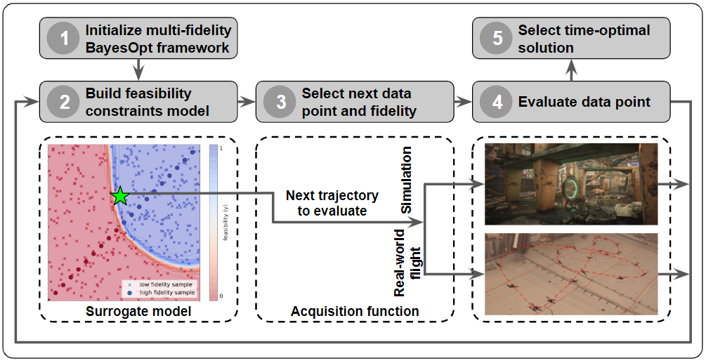

# mfboTrajectory
This code is the 2 drone implementation of the paper, "Cooperative Multi-Agent Trajectory Generation
with Modular Bayesian Optimization". [[Paper]](https://arxiv.org/abs/2206.00726)

[](https://www.youtube.com/watch?v=igwULi_H1Kg) - TODO

This code uses the PID controller instead of [INDI controller](https://arxiv.org/abs/1809.04048) which is used in the original paper.
This repository is composed of three main packages; *pyTrajectoryUtils*, *pyMulticopterSim*, and *mfboTrajectory*.
*pyTrajectoryUtils* includes the code for minimum-snap trajectory generation and PID controller. *pyMulticopterSim* provides the python wrapper for the [multicopterDynamicsSIm](https://github.com/mit-fast/multicopterDynamicsSim), which is used in the simulator [FlightGoggles](https://github.com/mit-fast/FlightGoggles). *mfboTrajectory* includes the core algorithm of the proposed papers, such as low-fidelity bayesian optimization frameworks and evaluations of different fidelities.

Tp use Cuda acceleration for the code, uncomment the line 9 in run_docker.sh 
## Installation with docker
```bash
git clone https://github.com/rachel-lim/multi-agent-bayes-opt.git mfboTrajectory
cd mfboTrajectory
git submodule update --init --recursive
docker build -t mfbo_traj .
./run_docker.sh
python3.6 -m pip install 'setuptools<=57.5.0'
source setup_venv/setup.bash
python setup.py install
```


## Trajectory optimization with polytopes and waypoints constraints
For enforcing polytopes and waypoints constriants for 2 drones, it requires the optimizer for the quadratic programming. In this code, we use the OSQP as the default optimizer. We also have flags setup to use data that we have aready generated as part of this project, so you can run the code without the need to generate the data again. The following commands are the example of how to run the code.
```bash
# To run the entire algorithm, including the initialization and optimization in the simulated environment.
python run_multi_agent_bayes_opt.py -a -d -t

# To use the optimized time sets and snaps and continue with rest of the optimization.
python run_multi_agent_bayes_opt.py -d -t

# To use the generated datasets for Drone model training
python run_multi_agent_bayes_opt.py -t

# To use the final optimized time sets and snaps from modular Bayesian Optimization
python run_multi_agent_bayes_opt.py

# To view the output trajectory, you have to run the jupyter server on the docker container.
```bash
docker exec -it mfbo_traj /bin/bash
jupyter notebook
```
Copy the URL from the above command and paste it in the browser. Then, open plot_results.ipynb from the base folder and run the code.


# To run the entire algorithm, including the initialization and optimization in the simulated environment.
python run_mfbo_polytopes.py -t 0 -s 0
# Initialization for the hybrid environment (Find the initial time allocation for the real-world flights)
python run_mfbo_polytopes_robot_tune.py -a 1.2
# Optimization in simulated environment.
python run_mfbo_polytopes_robot.py
```
